# TOI 5807 — Check-by-check (plots-first)

This is a static companion to `docs/tutorials/10-toi-5807-check-by-check.ipynb`.

- Open this file if you want to review the plots in any IDE without executing a notebook.
- Open the notebook for the full, runnable walkthrough and the per-check expected output blocks.

Pre-rendered images live in `docs/tutorials/artifacts/10-toi-5807-check-by-check/`.

## V01 — Odd/Even depth comparison

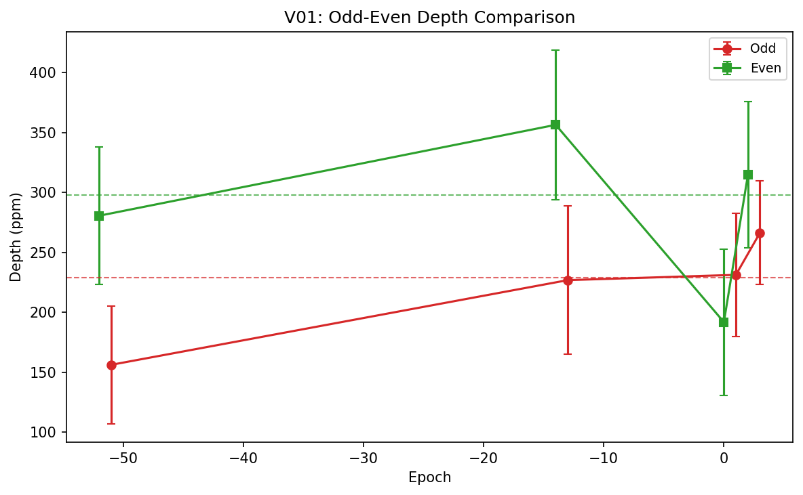

## V02 — Secondary eclipse search

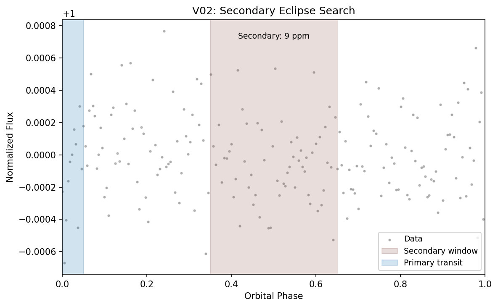

## V03 — Duration consistency

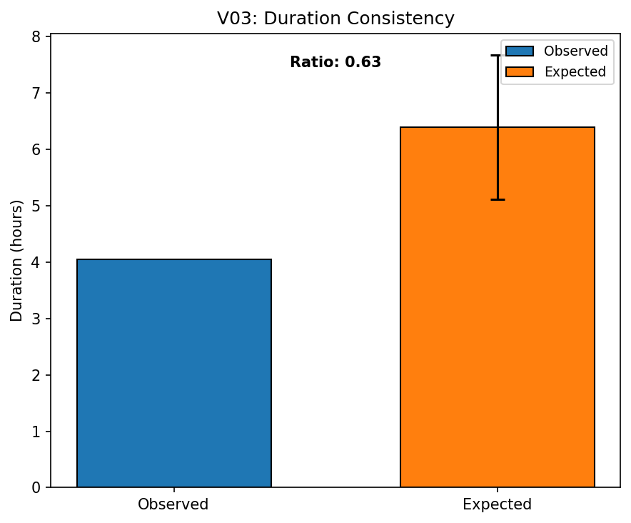

## V04 — Depth stability

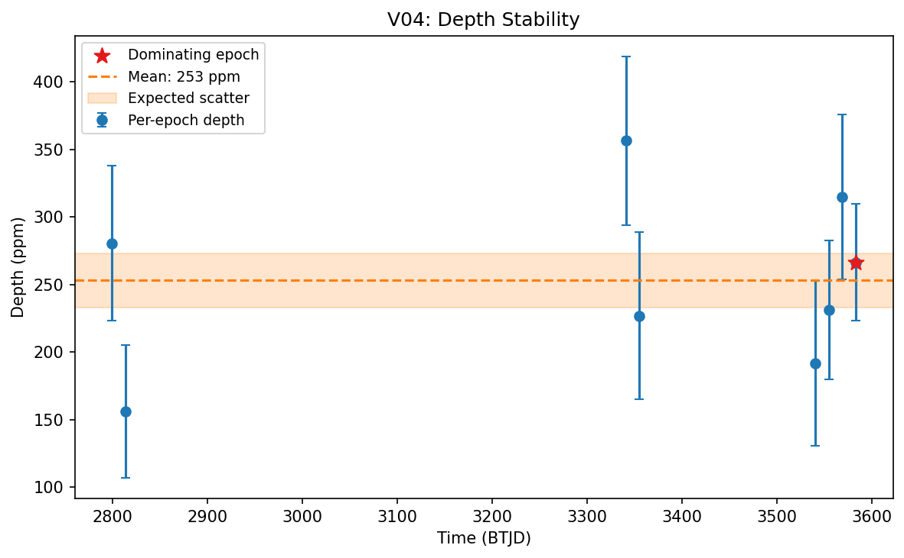

## V05 — Transit shape

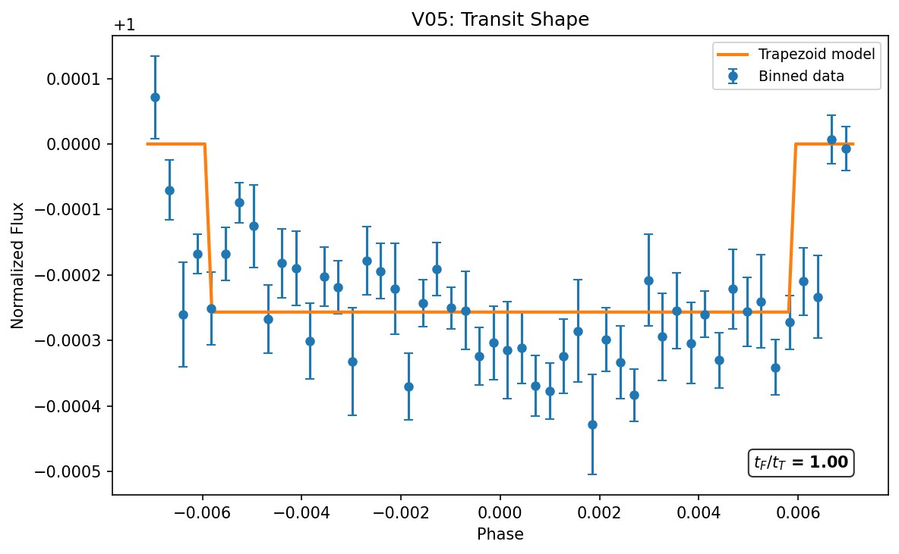

## V06 — Nearby eclipsing binaries

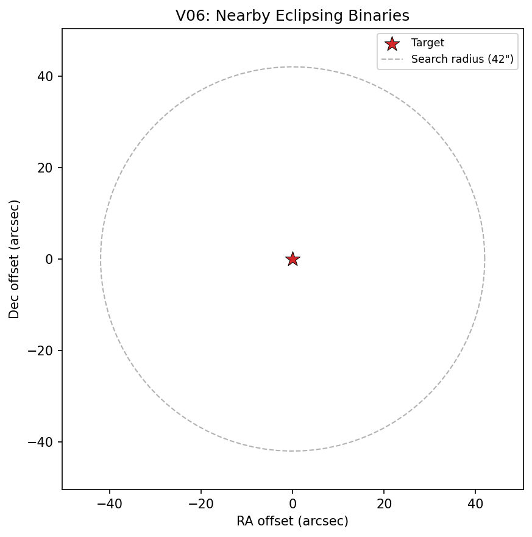

## V07 — ExoFOP TOI lookup

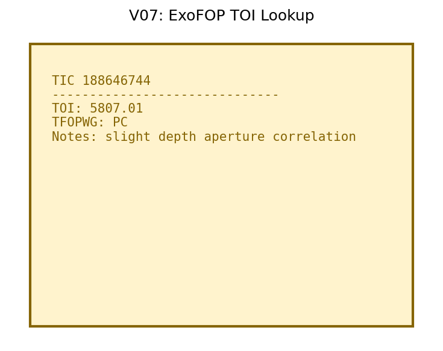

## V08 — Centroid shift (last sector)

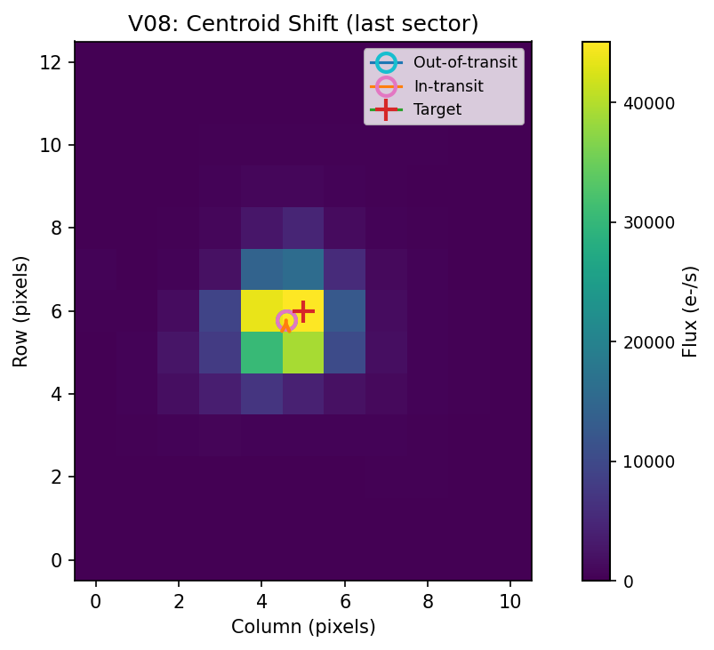

## V09 — Difference image (last sector)

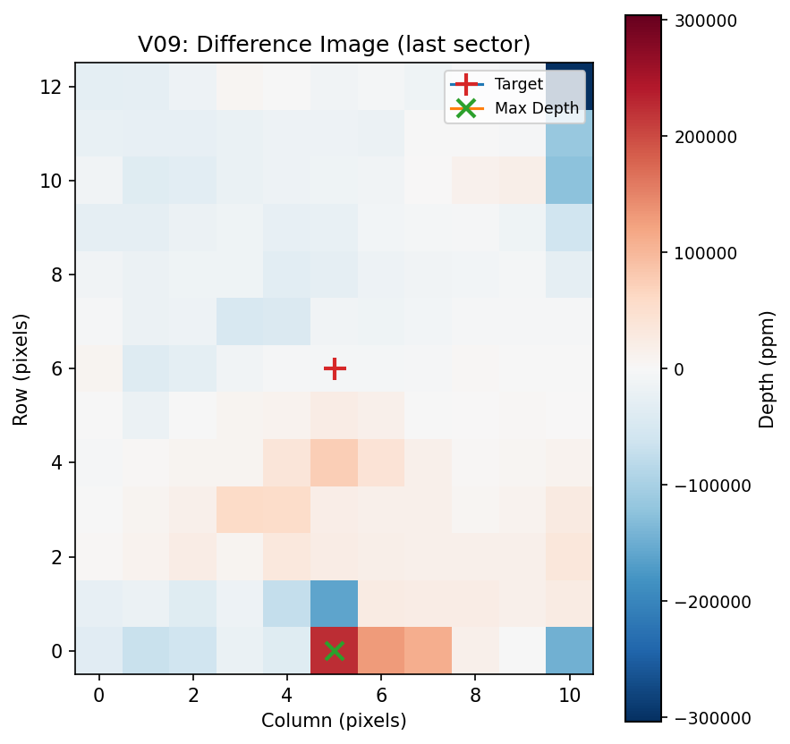

## V10 — Aperture dependence (last sector)

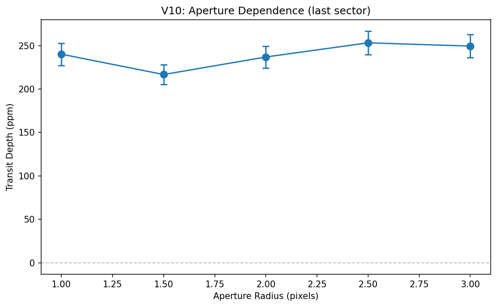

## V11 — ModShift

## V12 — SWEET

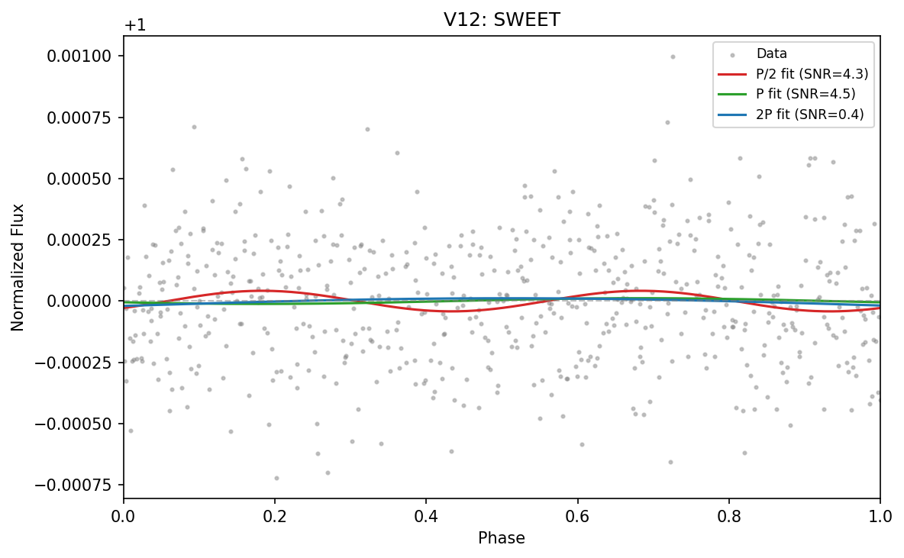

## V13 — Data gaps

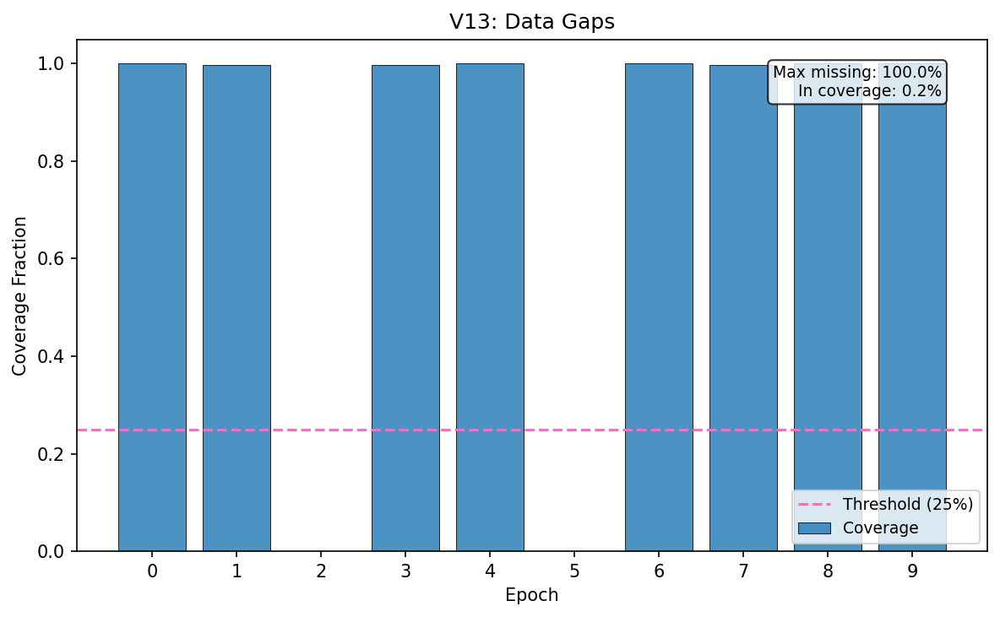

## V15 — Transit asymmetry

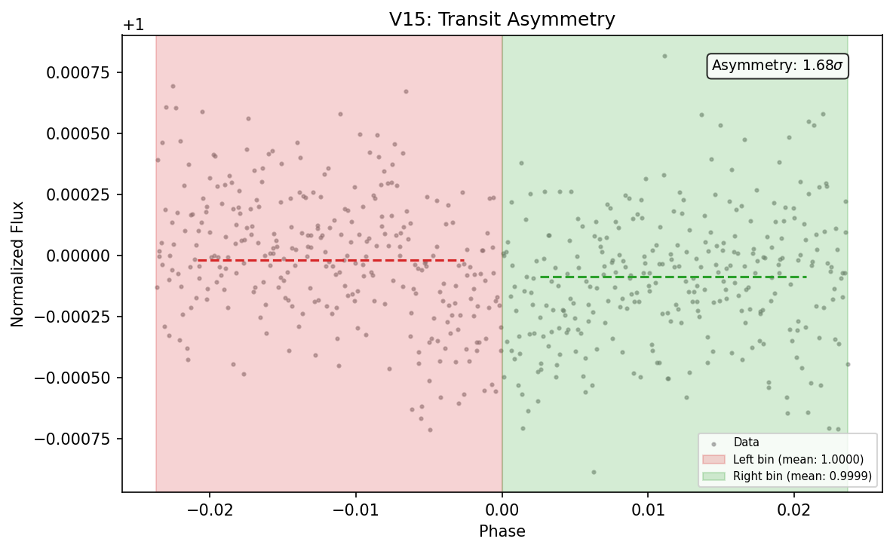

